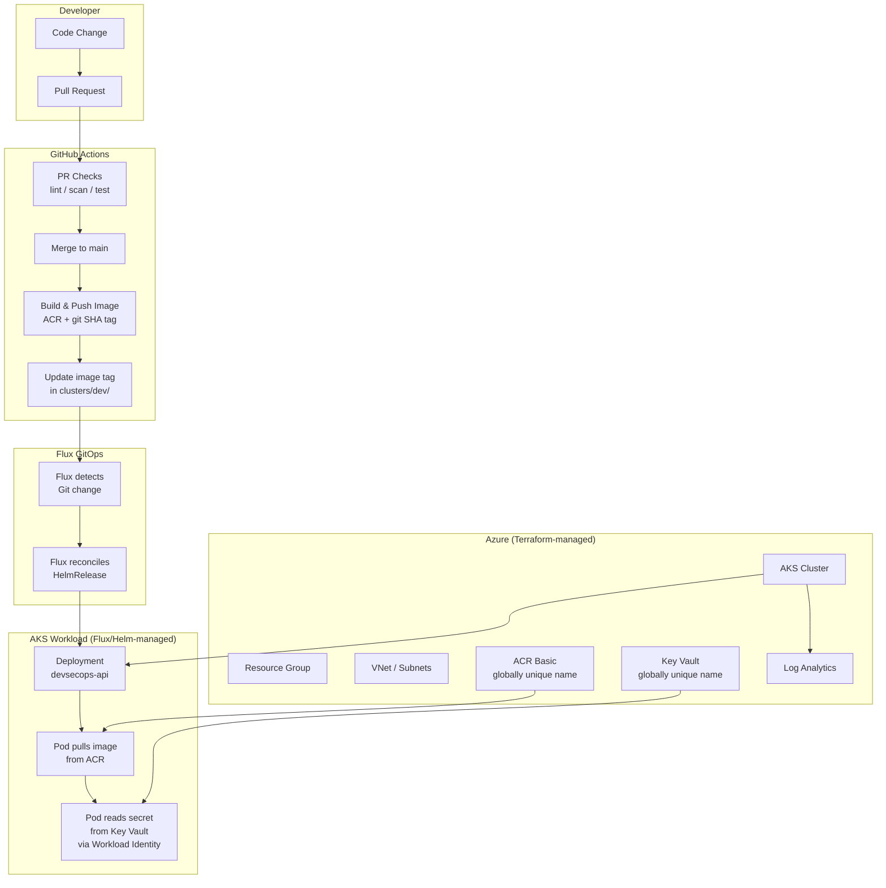

# Azure-Terraform-AKS-GitOps-Secure-Platform

AKS GitOps platform project built around Terraform-managed Azure infrastructure and Flux-managed Kubernetes workloads.

## Why This Project

This is **L6** in my Azure/Terraform portfolio progression:

| Level | Project | Key Milestone |
|-------|---------|---------------|
| L1 | Azure Terraform Linux VM | First Azure VM with Terraform |
| L2 | Azure Terraform Secure Two-Tier Infrastructure | Multi-tier networking |
| L3 | Azure Terraform Secure Private Platform | Private compute, Bastion access, Key Vault, monitoring |
| L4 | Azure Terraform Load Balanced Web Platform | Load balancing, availability |
| L5 | Azure Terraform DevSecOps Container Platform | Container Apps, ACR, Key Vault, CI/CD, security scanning |
| **L6** | **AKS GitOps Secure Platform** | **Kubernetes, Helm, Flux GitOps, Workload Identity** |

L5 deployed containers to Azure Container Apps using GitHub Actions as the deployment mechanism. L6 moves to Kubernetes (AKS) with **GitOps**: Flux watches this repository and reconciles cluster state automatically. The point is to keep a clean split: Terraform handles the Azure layer, while GitOps handles what runs inside the cluster.

## Architecture



## Tech Stack

- **Cloud:** Azure (Germany West Central)
- **IaC:** Terraform (3 layers: bootstrap, core, aks)
- **Container Registry:** Azure Container Registry (Basic)
- **Orchestration:** Azure Kubernetes Service (dev-test, single node)
- **Packaging:** Helm
- **GitOps:** Flux v2
- **Secrets:** Azure Key Vault + Workload Identity / CSI Driver
- **CI/CD:** GitHub Actions with OIDC (no static secrets)
- **Security Scanning:** Checkov, Trivy, Helm lint
- **Observability:** Log Analytics, kubectl logs, Azure Monitor basics
- **App:** Python FastAPI with Kubernetes-aware diagnostic endpoints

## Repository Structure

```
├── app/                    # FastAPI application + Dockerfile + tests
├── infra/
│   ├── bootstrap/          # Terraform remote state storage
│   ├── core/               # Shared Azure resources (RG, VNet, ACR, KV, Log Analytics)
│   ├── aks/                # AKS cluster provisioning
│   └── modules/            # Reusable Terraform modules
├── charts/
│   └── devsecops-api/      # Helm chart for the application
├── clusters/
│   └── dev/                # Flux GitOps desired state
│       ├── apps/           # HelmRelease, namespace, repo source
│       └── policies/       # NetworkPolicy
├── k8s/                    # Local dev manifests, RBAC, troubleshooting
├── scripts/                # Local kind helper scripts and validation utilities
├── docs/                   # Architecture, deployment, security, runbooks
│   ├── phase-0-review.md   # Guardrails corrected before implementation
│   └── incidents/          # Incident writeups (ImagePullBackOff, probe failures, etc.)
└── .github/workflows/      # CI/CD pipelines
```

## Important Design Guardrails

- Azure globally unique resources such as Storage Accounts, ACR and Key Vault must use a random or configurable suffix.
- `Standard_B2s` is only a target candidate, not a guarantee. Always check quota and SKU availability first.
- Commit `.terraform.lock.hcl` once Terraform files exist; do not commit `.terraform/`, state files, real tfvars, backend config, kubeconfig or secrets.
- Use `backend.hcl.example` as a template and keep the real `backend.hcl` ignored.
- If Flux deploys a Helm chart stored in this same repo, use Flux `GitRepository` + `HelmRelease`, not `HelmRepository`.
- Protect GitHub Actions from loops when a workflow commits image tag updates under `clusters/dev/`.

## Deployment Flow

1. **Bootstrap**: Create Terraform remote state storage account.
2. **Core**: Provision resource group, VNet, ACR, Key Vault, Log Analytics, identities.
3. **AKS**: Provision AKS cluster with OIDC issuer, ACR pull, Log Analytics integration.
4. **Flux**: Bootstrap Flux on the cluster, pointing at `clusters/dev/`.
5. **Image**: GitHub Actions builds the app image and pushes to ACR.
6. **GitOps**: GitHub Actions updates the image tag in Git with loop protection (`paths-ignore` or `[skip ci]`); Flux deploys it.
7. **Validate**: Smoke tests confirm the app is running.
8. **Cleanup**: `terraform destroy` in reverse order when done.

## GitOps Flow

```
code change → PR → merge → image build → tag update in Git → Flux reconciles → app deployed
```

GitHub Actions builds and pushes the image. Flux owns the deployment. `kubectl apply` is not the deployment mechanism: Git is.

## Security Model

- GitHub Actions authenticates to Azure via **OIDC federated credentials** (no static secrets).
- AKS pulls images from ACR via **managed identity role assignment**.
- The app pod accesses Key Vault via **Workload Identity** (OIDC-based, no credentials in the pod).
- Secrets are never printed in logs, outputs, or API responses.
- Container runs as non-root with read-only filesystem where feasible.
- Basic NetworkPolicy restricts pod-to-pod traffic.

## Cost Warning

This project is designed for **dev/learning use**. Even so, an AKS cluster with a single node costs money while running. The AKS node VM is the main cost driver, and the exact hourly cost depends on the selected VM size, Azure region, current pricing and available quota.

Key cost sources:

- AKS node VM (main cost; verify selected SKU pricing before deployment)
- Public IP / LoadBalancer (only if using ingress-nginx or a LoadBalancer Service)
- Log Analytics ingestion/retention beyond free allowances
- ACR Basic
- Key Vault operations
- Terraform state Storage Account

**Always run `terraform destroy` when you're done validating.** See [docs/cost-and-cleanup.md](docs/cost-and-cleanup.md).

## Prerequisites

- Azure subscription with sufficient quota in Germany West Central
- Azure CLI
- Terraform >= 1.5
- Docker
- Python 3.12+
- kubectl
- Helm 3
- Flux CLI (installed in Phase 6)
- Git + GitHub account

## Setup

Detailed steps in [docs/deployment-guide.md](docs/deployment-guide.md).

## Validation

```bash
# Check pods
kubectl get pods -n devsecops-api

# Check app health
kubectl port-forward svc/devsecops-api 8000:8000 -n devsecops-api
curl http://localhost:8000/health

# Check Flux status
flux get kustomizations
flux get helmreleases -n devsecops-api
```

## Cleanup

```bash
# Uninstall Flux
flux uninstall

# Destroy AKS
cd infra/aks && terraform destroy

# Destroy core resources
cd ../core && terraform destroy

# Destroy bootstrap (optional: state storage is cheap)
cd ../bootstrap && terraform destroy

# Verify in Azure Portal that the resource group is gone
```

## Limitations (v1)

- Single-node AKS cluster (not HA). VM size is selected only after checking quota/SKU availability.
- Public cluster (not private endpoint).
- No service mesh.
- No Azure Firewall / NAT Gateway.
- No multi-environment (dev only).
- Observability is basic (Log Analytics + kubectl, no Prometheus/Grafana in v1).
- Ingress is optional; primary validation via port-forward.

## Future Improvements

- Add staging/production environments.
- Enable Prometheus + Grafana.
- Add private cluster with private endpoints.
- Add policy enforcement (OPA/Gatekeeper or Kyverno).
- Add Flux image automation for fully automated tag updates.
- Add canary/progressive deployments.

## Author

**Karim El Atfy (Kay)**
- Portfolio: [kaystack.dev](https://kaystack.dev)
- GitHub: [github.com/KarimElAtfy](https://github.com/KarimElAtfy)

## License

MIT

