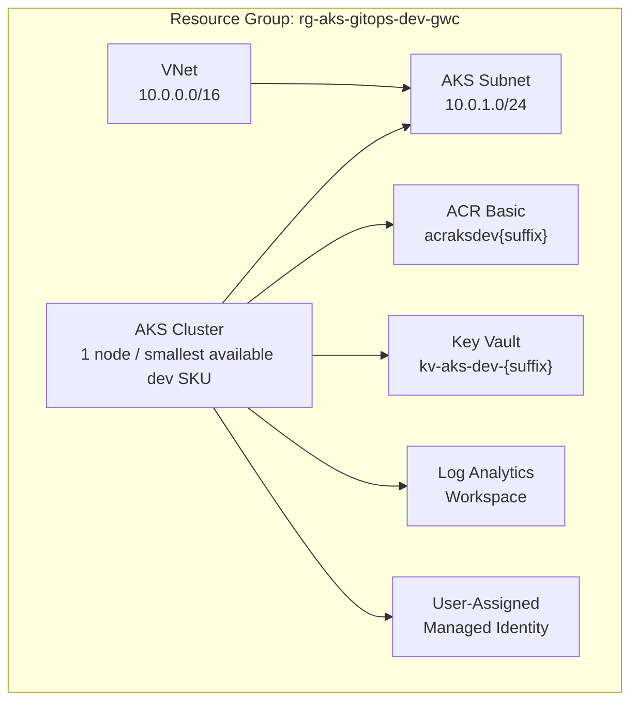
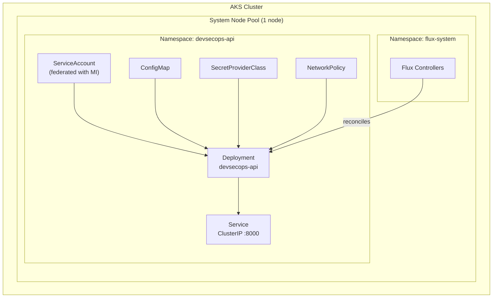
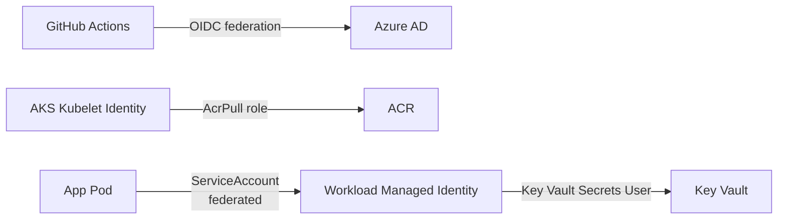

# Architecture

## Overview

The platform is dev-focused and cost-conscious. It uses:

- **Terraform** manages all Azure infrastructure across three layers.
- **GitHub Actions** builds container images and pushes them to ACR.
- **Flux** watches this Git repository and deploys workloads to AKS via Helm.
- **Key Vault + Workload Identity** provides secure secret access without credentials in the pod.

**Boundary:** Terraform owns Azure resources. Flux and Helm own Kubernetes workloads. They should not manage the same objects.

## Azure Resources

## Terraform Layers

### Layer 1: Bootstrap (`infra/bootstrap/`)

Creates the Azure Storage Account and container used for Terraform remote state. This is applied first and only once. It uses local state intentionally: the state backend can't store its own state.

Resources created:
- Resource Group for state storage
- Storage Account
- Blob Container

### Layer 2: Core (`infra/core/`)

Creates the shared Azure resources that AKS and the application depend on.

Resources created:
- Resource Group (main project resources)
- Virtual Network + AKS Subnet
- Azure Container Registry (Basic SKU, globally unique name)
- Azure Key Vault (standard SKU, RBAC authorization, globally unique name)
- Log Analytics Workspace
- User-Assigned Managed Identity (for workload identity federation)
- Key Vault role assignment for the workload identity, where possible before AKS federation

### Layer 3: AKS (`infra/aks/`)

Creates the AKS cluster and connects it to the resources from the core layer.

Resources created:
- AKS Cluster (public, dev-test, Free tier)
- System node pool (1 node, smallest available AKS-supported dev SKU; Standard_B2s is only a target candidate)
- OIDC Issuer enabled
- Workload Identity enabled
- Key Vault CSI Driver addon
- Log Analytics integration (Container Insights)
- ACR pull role assignment for the kubelet identity
- Federated identity credential linking the Kubernetes ServiceAccount to the user-assigned managed identity

## AKS Cluster Design

## Application Deployment Model

The app is never deployed by `kubectl apply` or by GitHub Actions directly. The flow is:

1. Developer merges code to `main`.
2. GitHub Actions builds the Docker image, tags it with the git commit SHA, and pushes to ACR.
3. GitHub Actions updates the image tag in `clusters/dev/apps/helmrelease.yaml` and commits with loop protection (`paths-ignore` or `[skip ci]`).
4. Flux detects the Git change within its polling interval.
5. Flux reconciles the HelmRelease, which renders the Helm chart with the new tag.
6. Kubernetes pulls the new image from ACR and rolls out the deployment.

This is the GitOps pattern: **Git is the source of truth for desired state.** The cluster continuously converges toward what Git says.

## Network Design

Simple flat network for dev:
- VNet: `10.0.0.0/16`
- AKS Subnet: `10.0.1.0/24`
- AKS networking mode must be chosen explicitly during implementation after checking current AKS support and project needs.
- NetworkPolicy support must match the selected AKS networking/policy engine.
- No Azure Firewall, NAT Gateway, or private endpoints in v1
- AKS API server is public (dev-test only)

## Identity and Access

- GitHub Actions uses OIDC: no client secrets stored in GitHub.
- AKS kubelet identity has AcrPull on the container registry.
- A user-assigned managed identity is federated with a Kubernetes ServiceAccount.
- The pod uses that ServiceAccount to access Key Vault via Workload Identity.

## Naming and Uniqueness

Azure Storage Account, Azure Container Registry and Key Vault names are globally unique. The implementation must not rely on fixed names such as `staksgitosstatedev` or `acraksdevgwc` without a suffix. Use either:

- a generated random suffix in Terraform, or
- a user-provided `name_suffix` variable documented in `terraform.tfvars.example`.

The README may show example names, but Terraform code must generate or accept unique values.

## Flux Source Model

The Helm chart lives inside this same Git repository under `charts/devsecops-api/`. For that reason, the intended Flux model is:

- `GitRepository` source pointing to this repository.
- `HelmRelease` referencing the chart path inside that Git source.

Do not use `HelmRepository` unless the chart is later published to an external Helm/OCI registry.
